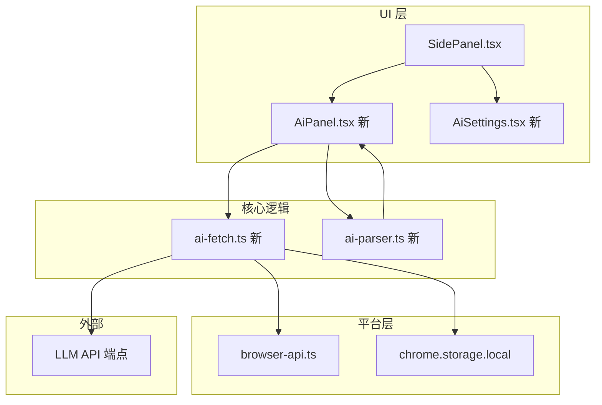

# URL AI 生成器 技术设计文档

Feature Name: url-ai-generator
Updated: 2026-08-11

## Description

新增 URL AI 书源生成功能：用户输入小说网站 URL，扩展自动爬取页面 HTML，调用兼容 OpenAI 格式的 LLM API，生成完整书源规则。用户可预览、修改、应用或导出。

## Architecture



## Components and Interfaces

### 1. AI 设置 (`src/ui/components/AiSettings.tsx`)

```typescript
// 状态接口
interface AiSettingsState {
  apiKey: string;           // 实际值，存 storage
  apiKeyDisplay: string;    // UI 显示值（******）
  showApiKey: boolean;      // 是否显示 key
  baseUrl: string;          // LLM 端点
  model: string;            // 模型名
  isSaved: boolean;         // 是否已保存过
}

// Props
interface AiSettingsProps {
  onSave: (settings: { apiKey: string; baseUrl: string; model: string }) => void;
  onLoad: () => Promise<{ apiKey: string; baseUrl: string; model: string }>;
}
```

**交互流程：**
1. 组件挂载时从 `chrome.storage.local` 加载设置
2. API Key 显示为 `••••••••`，提供显示/隐藏切换
3. 保存时写入 storage，更新 `stateVersion` 触发持久化

### 2. AI 生成面板 (`src/ui/components/AiPanel.tsx`)

```typescript
// 生成状态
type AiGenerateStatus = 'idle' | 'fetching' | 'generating' | 'success' | 'error';

// AI 生成结果
interface AiGenerateResult {
  status: AiGenerateStatus;
  bookSource: Record<string, string> | null;
  rawResponse: string | null;
  error: string | null;
}
```

**UI 布局：**
```
┌─────────────────────────────────┐
│  [URL 输入框______________]      │
│  [🤖 生成书源] [当前页URL]       │
├─────────────────────────────────┤
│  加载状态: 正在爬取页面...       │
│  或: 正在分析页面结构...         │
├─────────────────────────────────┤
│  结果预览（生成成功后显示）       │
│  ┌─────────────────────────┐   │
│  │ 书源名称: xxx           │   │
│  │ 搜索 URL: xxx           │   │
│  │ 列表选择器: xxx         │   │
│  │ ...                     │   │
│  └─────────────────────────┘   │
│  [应用到规则页] [复制 JSON]     │
└─────────────────────────────────┘
```

### 3. AI 爬取与请求 (`src/core/ai-fetch.ts`)

```typescript
export interface AiRequestConfig {
  url: string;
  apiKey: string;
  baseUrl: string;
  model: string;
}

export interface AiResponse {
  bookSource: Record<string, string>;
  rawText: string;
}

// 系统提示词：告知 LLM 生成 Legado 书源 JSON
const SYSTEM_PROMPT = `你是一名专业的小说书源生成助手。用户会提供一个小说网站 URL 和页面 HTML，你需要分析页面结构并生成 Legado 阅读 APP 可用的书源规则 JSON。

书源字段说明：
- name: 书源名称
- url: 基础URL
- searchUrl: 搜索URL，用 {{key}} 表示搜索词
- ruleSearch: 搜索规则JSON
- ruleBookInfo: 书籍信息规则JSON
- ruleToc: 目录规则JSON
- ruleContent: 正文规则JSON

输出格式必须是合法 JSON，包含以下字段（如果无法确定则留空字符串）：
{
  "name": "书源名称",
  "url": "基础URL",
  "searchUrl": "搜索URL模板",
  "ruleSearch": "{列表选择器,标题,链接}",
  "ruleBookInfo": "{源URL:,封面:,作者:,简介:,目录URL:,最新章节:}",
  "ruleToc": "{章节列表选择器,章节标题,章节链接,上一章:,下一章:,}",
  "ruleContent": "{正文URL:,正文:,替换规则:,charset:}"
}

只输出JSON，不要包含任何解释或其他文字。`;

export async function fetchAiBookSource(config: AiRequestConfig): Promise<AiResponse>;
export async function fetchPageContent(url: string): Promise<string>;
```

### 4. AI 结果解析 (`src/core/ai-parser.ts`)

```typescript
// 从 LLM 原始文本中提取 JSON
export function parseAiResponse(rawText: string): Record<string, string> | null;

// 将 AI 结果映射到 Legado 书源格式
export function transformAiResult(raw: Record<string, string>): BookSource;
```

### 5. Store 扩展 (`src/store/index.ts`)

在 `SettingsState` 中新增 AI 设置字段：

```typescript
export interface SettingsState {
  theme: 'light' | 'dark';
  language: string;
  aiApiKey: string;
  aiBaseUrl: string;
  aiModel: string;
}
```

## Data Models

### AI 设置存储 Key

```typescript
// chrome.storage.local key
AI_SETTINGS_KEY = 'ai_settings'

// 存储结构
interface StoredAiSettings {
  apiKey: string;
  baseUrl: string;
  model: string;
  updatedAt: number;
}
```

### LLM 请求格式

```typescript
interface LLMRequest {
  model: string;
  messages: [
    { role: 'system'; content: string },
    { role: 'user'; content: string }
  ];
  temperature: 0.3;
  max_tokens: 4096;
}

interface LLMResponse {
  choices: Array<{ message: { content: string } }>;
}
```

## Correctness Properties

1. **API Key 安全**：Key 永不出现在 URL、日志、错误信息中，仅作为 Authorization header 值传输
2. **HTML 截断**：页面 HTML 超过 15000 字符时截断，避免超出 LLM token 限制
3. **JSON 解析容错**：LLM 响应可能包含 markdown 代码块包裹，解析时需去掉 ```json 前缀
4. **超时控制**：HTTP 请求超时 15s，LLM 请求超时 60s
5. **幂等性**：相同 URL 重复生成不会产生额外请求（有缓存）

## Error Handling

| 场景 | 错误处理 |
|------|---------|
| API Key 未配置 | 禁用生成按钮，显示"请先配置 AI 设置"提示 |
| 页面爬取失败 | 显示"无法获取页面内容"，展示 HTTP 状态码 |
| LLM API 认证失败 | 显示"API Key 无效或已过期" |
| LLM API 配额不足 | 显示"模型配额不足，请检查账户余额" |
| LLM 返回非 JSON | 显示原始文本并提示"生成结果格式异常，请手动整理" |
| 网络超时 | 显示"请求超时，请检查网络或稍后重试" |

## Test Strategy

1. **单元测 AI 解析**：`tests/unit/ai-parser.test.ts` - 验证 JSON 提取、markdown 代码块剥离
2. **单元测 HTML 截断**：`tests/unit/ai-fetch.test.ts` - 验证截断逻辑、错误处理
3. **E2E 测 AI 面板**：`tests/e2e/ai-generate.spec.ts` - 验证完整生成流程（mock fetch）

## References

- [Legado 书源格式文档](https://gedoor.github.io/MyBookshelf/legado/booksource/)
- [OpenAI API 文档](https://platform.openai.com/docs/api-reference)
- [DeepSeek API 文档](https://platform.deepseek.com/api-docs/)
